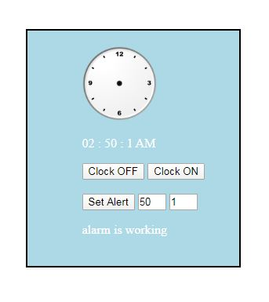

# JS-clock-with-alarm
I used javascript 6 to create an hour with alarm, it's a single page javascript application, and how to set an alarm: set minutes on the first left and hours in next input, then click set alarm."note set it within one minute of your current time" wait and then the content will change Until he arrives in the next minute, the next update add sound to it and maybe find easy way with svg or canvas to make it with clock hands

## Note:
*  if you want set the alram to 1:15 am, insert the values like this 15 1 
*  1 = 1am , 13 = 1pm
*  the app accept only 1 alarm only if you need another one click F5 or right click then click on refresh. 
